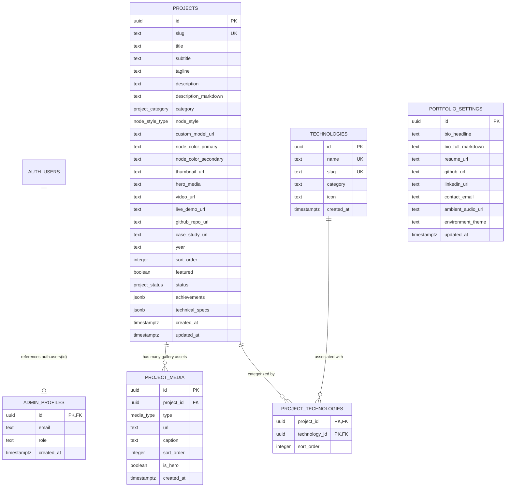

# Supabase Backend Architecture & Database Schema

## 1. Architectural Overview

The backend for the 3D Developer Portfolio is built on top of **Supabase (PostgreSQL 15+)**. It is designed with the following core architectural principles:

- **Relational Integrity**: Fully normalized schema for technologies (many-to-many) and media assets (one-to-many) paired with indexed query paths.
- **Zero-Trust Row Level Security (RLS)**: Public anonymous visitors can strictly read published records only. All write operations (insert, update, delete, reorder, publish, unpublish, media management) require verified administrator privileges verified against an `admin_profiles` table.
- **Privilege Isolation**: The client application only ever receives the public anonymous key (`VITE_SUPABASE_ANON_KEY`). The `service_role` key is **strictly forbidden** in browser bundles.
- **Continuous 3D Waypoint Sequencing**: The `projects.sort_order` field governs the exact physical placement along the continuous 3D Catmull-Rom spline curve ($t_i = (i + 1) / (N + 1)$).

---

## 2. Entity-Relationship Diagram (ERD)



---

## 3. Database Schema Specification

### 3.1 Custom Enums
- **`project_category`**: `'game_dev'`, `'ai_ml'`, `'systems_engine'`, `'three_d_graphics'`, `'web_fullstack'`
- **`project_status`**: `'draft'`, `'published'`, `'archived'`
- **`node_style_type`**: `'hologram_pedestal'`, `'cyber_terminal'`, `'data_monolith'`, `'custom_glb'`
- **`media_type`**: `'image'`, `'video'`

### 3.2 Tables

#### `public.admin_profiles`
Maintains verified administrative user profiles linked to Supabase Auth (`auth.users`).
| Column | Type | Constraints | Description |
| :--- | :--- | :--- | :--- |
| `id` | `UUID` | `PK`, `REFERENCES auth.users(id) ON DELETE CASCADE` | Auth user ID |
| `email` | `TEXT` | `NOT NULL` | Administrator email |
| `role` | `TEXT` | `NOT NULL DEFAULT 'admin'` | Role classification (`admin`, `superadmin`) |
| `created_at` | `TIMESTAMPTZ` | `DEFAULT NOW()` | Record creation timestamp |

#### `public.projects`
Central entity representing 3D spatial milestones along the portfolio journey.
| Column | Type | Constraints | Description |
| :--- | :--- | :--- | :--- |
| `id` | `UUID` | `PK DEFAULT gen_random_uuid()` | Unique project identifier |
| `slug` | `TEXT` | `UNIQUE NOT NULL` | URL slug for deep linking (`/project/:slug`) |
| `title` | `TEXT` | `NOT NULL` | Project headline title |
| `subtitle` | `TEXT` | `NULL` | Technical subtitle / subsystem descriptor |
| `tagline` | `TEXT` | `NOT NULL` | Concise 1-sentence technical summary |
| `description` | `TEXT` | `NULL` | Plain text summary |
| `description_markdown` | `TEXT` | `NOT NULL` | Full technical dossier in markdown format |
| `category` | `project_category` | `NOT NULL` | Discipline classification |
| `node_style` | `node_style_type` | `DEFAULT 'hologram_pedestal'` | 3D visual archetype |
| `custom_model_url` | `TEXT` | `NULL` | Optional GLTF/GLB model URI |
| `node_color_primary` | `TEXT` | `DEFAULT '#38bdf8'` | Hex primary beacon & glow color |
| `node_color_secondary`| `TEXT` | `DEFAULT '#0284c7'` | Hex wireframe & secondary accent color |
| `thumbnail_url` | `TEXT` | `NOT NULL` | Primary high-res preview asset |
| `hero_media` | `TEXT` | `NULL` | Dedicated hero showcase asset URI |
| `video_url` | `TEXT` | `NULL` | Video walkthrough streaming URL (MP4/WebM) |
| `live_demo_url` | `TEXT` | `NULL` | External deployment URL |
| `github_repo_url` | `TEXT` | `NULL` | External git repository URL |
| `case_study_url` | `TEXT` | `NULL` | External whitepaper or deep case study |
| `year` | `TEXT` | `NULL` | Release year / completion date |
| `sort_order` | `INTEGER` | `NOT NULL DEFAULT 0` | Sequence index on the 3D spline track |
| `featured` | `BOOLEAN` | `DEFAULT FALSE` | Highlighted milestone status |
| `status` | `project_status` | `DEFAULT 'draft'` | Publication state (`draft`, `published`, `archived`) |
| `achievements` | `JSONB` | `DEFAULT '[]'::jsonb` | Array of quantified technical achievements |
| `technical_specs` | `JSONB` | `DEFAULT '[]'::jsonb` | Key-value engineering architecture matrix |
| `created_at` | `TIMESTAMPTZ` | `DEFAULT NOW()` | Record creation timestamp |
| `updated_at` | `TIMESTAMPTZ` | `DEFAULT NOW()` | Auto-updated via trigger |

#### `public.technologies` & `public.project_technologies`
Relational store for technology taxonomy and associations.
- `technologies`: `id`, `name`, `slug`, `category`, `icon`, `created_at`.
- `project_technologies`: Composite primary key `(project_id, technology_id)`, with `sort_order`.

#### `public.project_media`
Relational gallery and schematic assets linked to projects.
| Column | Type | Constraints | Description |
| :--- | :--- | :--- | :--- |
| `id` | `UUID` | `PK DEFAULT gen_random_uuid()` | Asset identifier |
| `project_id` | `UUID` | `REFERENCES projects(id) ON DELETE CASCADE` | Parent project |
| `type` | `media_type` | `DEFAULT 'image'` | Media type (`image` or `video`) |
| `url` | `TEXT` | `NOT NULL` | Asset storage URL |
| `caption` | `TEXT` | `NULL` | Schematic or screenshot annotation |
| `sort_order` | `INTEGER` | `DEFAULT 0` | Presentation carousel order |
| `is_hero` | `BOOLEAN` | `DEFAULT FALSE` | Flag for primary showcase banner |

---

## 4. Row Level Security (RLS) Policy Matrix

All tables have RLS explicitly enabled (`ALTER TABLE ... ENABLE ROW LEVEL SECURITY`).

| Table | Operation | Role | Policy Condition |
| :--- | :--- | :--- | :--- |
| **`projects`** | `SELECT` | `anon`, `authenticated` | `status = 'published' OR public.is_admin()` |
| **`projects`** | `INSERT` / `UPDATE` / `DELETE` | `authenticated` | `public.is_admin() = true` |
| **`project_media`** | `SELECT` | `anon`, `authenticated` | Linked project is `'published'` OR `public.is_admin()` |
| **`project_media`** | `INSERT` / `UPDATE` / `DELETE` | `authenticated` | `public.is_admin() = true` |
| **`technologies`** | `SELECT` | `anon`, `authenticated` | `true` (public taxonomy) |
| **`technologies`** | `INSERT` / `UPDATE` / `DELETE` | `authenticated` | `public.is_admin() = true` |
| **`project_technologies`**| `SELECT` | `anon`, `authenticated` | Linked project is `'published'` OR `public.is_admin()` |
| **`project_technologies`**| `INSERT` / `DELETE` | `authenticated` | `public.is_admin() = true` |
| **`admin_profiles`** | `SELECT` | `authenticated` | `id = auth.uid() OR public.is_admin()` |
| **`admin_profiles`** | `INSERT` / `UPDATE` / `DELETE` | `authenticated` | `public.is_admin() = true` |
| **`portfolio_settings`** | `SELECT` | `anon`, `authenticated` | `true` |
| **`portfolio_settings`** | `INSERT` / `UPDATE` | `authenticated` | `public.is_admin() = true` |
| **`storage.objects` (`project-media`)** | `SELECT` | `anon`, `authenticated` | `bucket_id = 'project-media'` |
| **`storage.objects` (`project-media`)** | `INSERT` / `UPDATE` / `DELETE`| `authenticated` | `bucket_id = 'project-media' AND public.is_admin()` |

### The `public.is_admin()` Function
```sql
CREATE OR REPLACE FUNCTION public.is_admin()
RETURNS BOOLEAN AS $$
BEGIN
    RETURN EXISTS (
        SELECT 1
        FROM public.admin_profiles
        WHERE id = auth.uid()
    );
END;
$$ LANGUAGE plpgsql SECURITY DEFINER SET search_path = public;
```
Declared as `SECURITY DEFINER` with fixed `search_path = public`, this function executes with system authority to check administrative membership without causing recursive RLS loops.

---

## 5. Deployment & Migration Instructions

### 5.1 Using the Supabase CLI
```bash
# 1. Login to Supabase CLI
npx supabase login

# 2. Link to your remote project
npx supabase link --project-ref <your-project-ref>

# 3. Apply all migrations
npx supabase db push
```

### 5.2 Using the Supabase Web Dashboard
1. Open the **SQL Editor** in the Supabase Dashboard.
2. Execute the migrations in exact chronological order:
   - `supabase/migrations/20260911000001_initial_schema.sql`
   - `supabase/migrations/20260911000002_row_level_security.sql`
   - `supabase/migrations/20260911000003_seed_data.sql`

---

## 6. Admin User Onboarding

To authorize an administrator:
1. Create a user via **Authentication > Users** in the Supabase Dashboard, or sign up via `auth.signUp`.
2. Insert their user ID into `admin_profiles`:
```sql
INSERT INTO public.admin_profiles (id, email, role)
VALUES ('<auth-user-uuid>', 'admin@portfolio.dev', 'superadmin');
```
Once added, this user has full administrative authorization to create, edit, delete, reorder, publish, and manage assets.

---

## 7. Security Rules for Frontend Development

1. **Never expose `SUPABASE_SERVICE_ROLE_KEY`**: It grants bypass permissions to all RLS policies. It must never be referenced in client code.
2. **Strict Anonymous Verification**: Always verify that unauthenticated `anon` queries cannot read draft projects:
   ```ts
   // Query will only return published records
   const { data } = await supabase.from('projects').select('*');
   ```
3. **Storage Security**: Uploads to `project-media` require an active session whose user ID exists in `admin_profiles`.
